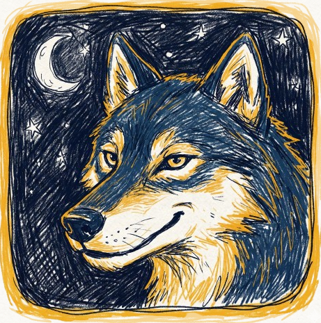

# 🐺 Lupus in Fabula App

  

  A modern, digital companion for the classic party game <b>Werewolf</b> (Lupus in Fabula). 
  Built with <b>Flutter</b> and <b>Firebase</b>.

  
  
  

---

## 📖 About The Project

This app simplifies the setup and management of the **Werewolf** board game. Instead of using cards and manually picking a narrator, the app handles the lobby, and a **Telegram Bot** secretly assigns roles to every player.

**Key Features:**
* 🎮 **Lobby System:** Create a room and share the code with friends.
* 🤖 **Telegram Integration:** Roles are sent via a Telegram Bot to ensure secrecy.
* 🎨 **Custom Design:** Hand-drawn indie style assets and "Night Blue" theme.
* 💰 **Monetization:** "Buy me a Coffee" support page.
* 🔒 **Secure Backend:** Game logic runs on Firebase Cloud Functions.

## 🛠️ Tech Stack

* **Frontend:** Flutter (Dart)
* **Backend:** Firebase Cloud Functions (Node.js)
* **Database:** Cloud Firestore
* **State Management:** Standard Flutter State
